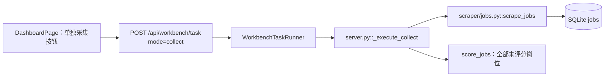
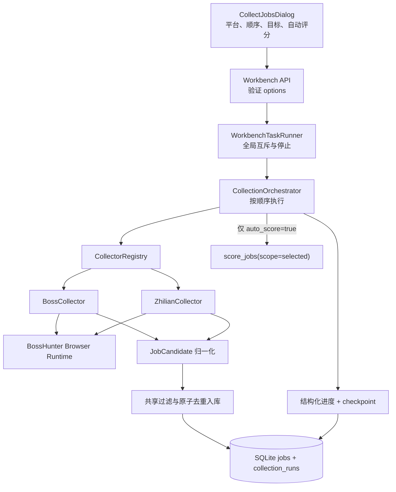

# BossHunter 智联招聘独立采集与多平台队列实施规划

> 文档状态：历史实施规划；不代表当前代码状态。当前以实时文件和 `LUNA_ZHILIAN_COLLECTION_HANDOFF_2026-08-16.md` 为准，本文中的“首版仅采集/评分”属于历史阶段边界。
>
> 调研日期：2026-08-15
>
> 目标执行者：Luna 及后续本地开发 Agent
>
> 工作目录：`D:\简历\BossHunter`

## 1. 文档目的

本规划用于在 BossHunter 当前代码基础上增加“智联招聘岗位采集”能力，并把现有 BOSS 采集改造成可扩展的多平台架构。

产品方向已经由用户确认，后续实施不要重新讨论以下决定：

- BOSS 和智联使用独立采集适配器、独立关键词、城市编码、页数、排序和目标数量。
- 两个平台共用求职资料、AI 设置、评分标准、过滤规则、岗位池、导出和回收站。
- 统一“岗位采集”窗口允许勾选一个或两个平台。
- 同时选择两个平台时严格串行，不并行操控浏览器。
- 默认执行顺序为 `BOSS → 智联`，用户可以调整顺序。
- 只选择智联时只运行智联；只选择 BOSS 时保持当前 BOSS 能力。
- 每个平台独立设置目标新增数量，也可选择不限数量。
- 只有通过过滤、去重并成功入库的新增岗位才计入目标数量。
- 采集结束时可选“自动评分”，且只评分本轮新增岗位。
- 自动评分后停止，不进入确认、招呼语、发送、简历投递或监测。
- 当前阶段智联只支持采集与共享评分，不实现智联自动投递。

## 2. 当前 Git 与工作区事实

本规划编写前执行了只读检查，结果如下：

```text
分支：codex/bosshunter-upstream-main
HEAD：62d1ccea878932f4e98ff67eaa00d5302c7cdff4
提交：feat: conservatively adapt selected PR #29 improvements (#44)
跟踪：upstream/main
工作树：干净
origin：https://github.com/zhenian-666/BossHunter.git
upstream：https://github.com/powerycy/BossHunter.git
```

当前 `HEAD` 与本地 `upstream/main` 完全一致。

这与早期交接记录中的 `codex/bosshunter-local-improvements` 和 `ec658d1` 不同。后续 Luna 必须以当前分支、当前文件和实时 Git 状态为准，不得为了恢复旧交接状态而切换、重置或回滚。

当前上游分支没有早期交接中列出的 `docs/LUNA_IMPLEMENTATION_GUIDE.md`、`docs/LUNA_EXPORT_DELETE_IMPLEMENTATION_GUIDE.md` 等文件；现有功能已经通过上游提交进入当前代码，不能据此误判功能缺失并重复实现。

## 3. 当前采集架构分析

### 3.1 当前控制流

当前 Web 端采集链路为：



关键文件：

- `src/bosshunter/scraper/jobs.py`
- `src/bosshunter/browser/__init__.py`
- `src/bosshunter/browser/client.py`
- `src/bosshunter/web/server.py`
- `src/bosshunter/web/tasks.py`
- `src/bosshunter/web/preflight.py`
- `src/bosshunter/web/frontend/src/hooks/useDashboard.ts`
- `src/bosshunter/web/frontend/src/pages/DashboardPage.tsx`
- `src/bosshunter/db.py`
- `src/bosshunter/ai/scorer.py`

### 3.2 当前 BOSS 采集器的职责过载

`scraper/jobs.py::scrape_jobs()` 同时承担：

1. BOSS 城市编码解析。
2. 生成 BOSS 搜索 URL。
3. BOSS 列表页 DOM 解析。
4. BOSS 详情页 DOM 解析。
5. 多城市 × 多关键词 × 多页循环。
6. 过滤、去重与 SQLite 入库。
7. 停止事件处理。
8. CLI Rich 进度输出。
9. Web 进度回调。

这种结构可以支持单个平台，但不适合直接加入智联。若把智联判断继续塞进该函数，会产生大量 `if platform == ...`，并使选择器、城市编码和错误处理互相污染。

### 3.3 当前浏览器边界

BossHunter 已有 Browser Runtime 门面：

- `new_tab()`
- `close_tab()`
- `evaluate()`
- `scroll()`
- `wait_for_load()`
- `get_page_info()`

它通过用户已经开启远程调试的 Chrome 工作，不需要项目读取或保存 Cookie。智联适配器应复用这一门面，不另起一套 Selenium、Playwright 浏览器或持久化浏览器账号。

### 3.4 当前进度缺口

当前采集进度回调仅包含：

```json
{
  "seen": 9,
  "new": 3,
  "duplicate": 4
}
```

Web 端只显示：

- 本轮扫描
- 本轮新增
- 重复岗位

当前没有：

- 目标数量
- `完成数/目标数`
- 百分比
- 当前平台
- 当前关键词、城市、页码
- 过滤、解析失败、保存失败数量
- 未达到目标的结束原因
- 多平台队列状态

CLI 虽然存在 `--limit`，但 Rich 任务使用 `total=None`，仍不显示 `6/10`。

### 3.5 当前自动评分行为不符合新需求

`server.py::_execute_collect()` 在采集后无条件调用 `score_jobs(score_config)`，处理的是全部未评分岗位，而不是本轮新增岗位。

必须改为：

```python
if options.auto_score and collected_job_ids:
    score_jobs(
        score_config,
        scope="selected",
        job_ids=collected_job_ids,
        limit=None,
        force_rescore=False,
    )
```

不得把历史未评分岗位混入本次自动评分。

### 3.6 当前预检行为不符合新需求

当前 `collect` 模式始终要求：

- 有效简历
- 搜索关键词
- AI Key
- 浏览器连接

新的规则应为：

- 纯采集：不要求 AI Key，也不应因为没有 AI Key 阻止采集。
- 勾选自动评分：才要求有效简历、AI Key 和 AI 连接。
- 关键词、城市和页面检查应按已选择的平台分别执行。
- 浏览器检查必须按平台报告 BOSS/智联页面和登录状态，不能只检查 BOSS。

### 3.7 当前数据库缺少来源边界

`jobs.id` 当前是 BOSS 岗位 ID，`jobs` 表没有来源平台字段。加入智联后会产生以下风险：

- 两个平台原始岗位 ID 可能碰撞。
- 岗位池无法展示或筛选来源。
- 导出文件无法说明岗位来自哪个平台。
- BOSS 发送器可能错误处理智联岗位。
- 删除、历史记录和评分任务无法判断平台能力。

## 4. GitHub 参考调研

### 4.1 搜索方法

调研日期：2026-08-15。

使用的关键词包括：

- `智联招聘 爬虫 Python zhaopin scraper`
- `zhaopin.com scraper jobs Python`
- `智联招聘 Playwright 爬虫`
- `multi platform job scraper China`
- `job source adapter registry`

评估维度：

- 是否真实包含智联或国内招聘平台。
- 是否有清晰的平台适配器边界。
- 是否支持统一岗位结构、去重和进度。
- 是否仍在维护。
- 是否有测试、错误分类和可观测性。
- 许可证能否允许复制；若不适合，则只参考架构思想。
- 是否包含绕过验证码、批量投递等不应复用的行为。

### 4.2 候选仓库池

| 仓库 | 相关性 | 结论 |
|---|---|---|
| [jason-huanghao/jobradar](https://github.com/jason-huanghao/jobradar) | 直接包含智联适配器、来源注册表、统一模型和来源健康状态 | 主要参考，但 GPL-3.0，只参考思想，不复制实现 |
| [loks666/get_jobs](https://github.com/loks666/get_jobs) | BOSS、猎聘、51job、智联独立模块，带进度回调 | 次要参考；智联被作者标注当前有问题，且是非商业自定义许可证 |
| [simonlin1212/Hiring-Radar](https://github.com/simonlin1212/Hiring-Radar) | 多来源统一 15 字段、公开数据边界、解析器分层 | 参考统一数据模型和合规边界，不提供智联实现 |
| [iszhouhua/zhaopin](https://github.com/iszhouhua/zhaopin) | 老智联采集与异步接口分析 | 明确过时；README 自己声明旧方式已失效，不作为实现依据 |
| [shuheng-mo/career-ops-china](https://github.com/shuheng-mo/career-ops-china) | 国内招聘平台、过滤与本地工作流 | 主张人机协作捕获而非自动采集，与本次目标不一致，只保留安全提醒 |
| [ever-jobs/ever-jobs](https://github.com/ever-jobs/ever-jobs) | 大规模多来源适配器和统一输出 | 技术栈、地区和体量不匹配，不值得引入其复杂度 |
| [exception-coder/npe_get_jobs](https://github.com/exception-coder/npe_get_jobs) | 多平台求职和平台代码映射 | 自动投递范围过大、Java 技术栈不匹配、来源关系不够清晰，排除 |

### 4.3 重点参考对比

| 项目 | 直接智联支持 | 架构价值 | 当前风险 | 许可证处理 |
|---|---:|---|---|---|
| JobRadar | 是 | `JobSource` 适配器、注册表、统一 `RawJob`、`ok/empty/error/blocked` 来源结果 | 其 REST 端点和 Playwright 代码可能随平台变化；不能把运行声明当成本地验证 | GPL-3.0，不复制源码或大段结构化实现 |
| Get Jobs | 是 | 每个平台独立 Worker/Service/Controller，统一平台接口和进度回调 | README 明确标注智联当前有问题；代码重点是自动投递，不符合本次只采集范围 | GETJOBS-NC-1.0，只参考模块边界，不复制 |
| Hiring Radar | 否 | 来源选择 → 归一化 → 过滤 → 输出；强调公开、低频、不绕登录/验证码 | 不覆盖智联登录平台，无法提供可直接运行的智联选择器 | MIT，但本次仍优先自行实现 |

### 4.4 已核验的事实

#### JobRadar

- 智联适配器位于 `src/jobradar/sources/adapters/zhilian.py`。
- 它把来源标识固定为 `zhilian`，并把岗位转换成统一 `RawJob`。
- 它使用“REST API 优先、浏览器回退”的两级策略。
- 来源注册表独立于适配器，并记录每个来源的结果。
- 来源状态明确区分 `ok`、`empty`、`error`、`blocked`。
- 仓库许可证是 GPL-3.0。

证据：

- [智联适配器源码](https://github.com/jason-huanghao/jobradar/blob/main/src/jobradar/sources/adapters/zhilian.py)
- [来源注册表源码](https://github.com/jason-huanghao/jobradar/blob/main/src/jobradar/sources/registry.py)
- [来源健康状态源码](https://github.com/jason-huanghao/jobradar/blob/main/src/jobradar/sources/health.py)
- [GPL-3.0 LICENSE](https://github.com/jason-huanghao/jobradar/blob/main/LICENSE)

#### Get Jobs

- 使用统一 `JobPlatformService` 表达平台名称、运行状态、停止和进度回调。
- 智联代码是独立模块，不和 BOSS Worker 混写。
- 智联进度回调包含 `message/current/total`。
- README 明确提示当前智联功能存在问题，因此不能把其选择器当成已验证可用。
- 许可证限制为非商业使用并要求保留署名。

证据：

- [统一平台接口](https://github.com/loks666/get_jobs/blob/f8094286b4768c2b0e3b1f6fc98011482c7ac16a/src/main/java/com/getjobs/worker/service/JobPlatformService.java)
- [智联独立 Worker](https://github.com/loks666/get_jobs/blob/f8094286b4768c2b0e3b1f6fc98011482c7ac16a/src/main/java/com/getjobs/worker/zhilian/ZhiLian.java)
- [项目说明](https://github.com/loks666/get_jobs)
- [GETJOBS-NC-1.0 LICENSE](https://github.com/loks666/get_jobs/blob/main/LICENSE)

#### Hiring Radar

- 使用“来源选择 → 归一化与过滤 → 统一输出”的结构。
- 明确只访问公开岗位数据，不绕登录、鉴权或验证码。
- 统一输出字段包含来源可追溯的岗位 ID、标题、公司、地点、日期、JD 和 URL。
- 许可证是 MIT。

证据：

- [项目说明与工作原理](https://github.com/simonlin1212/Hiring-Radar)
- [MIT LICENSE](https://github.com/simonlin1212/Hiring-Radar/blob/main/LICENSE)

### 4.5 可复用的设计思想

1. 每个平台实现相同采集协议。
2. 平台注册表只负责找到适配器，不包含平台选择器。
3. 平台输出先归一化，再进入共享过滤、去重和入库。
4. 每个平台独立记录结果状态与错误原因。
5. 进度回调使用结构化事件，不用解析日志文本。
6. 对外部页面变化使用 `blocked/selector_changed` 等明确结果，不能静默返回空列表。
7. 所有平台岗位必须携带来源字段。

### 4.6 不应复制的内容

- 不复制 JobRadar 的 GPL-3.0 智联源码、REST 请求实现或 Playwright 回退代码。
- 不复制 Get Jobs 的自动投递、批量点击、相似岗位投递、Cookie 持久化或反检测逻辑。
- 不引入第二套独立浏览器管理器。
- 不把未经本项目验证的智联 API 地址声明为稳定官方接口。
- 不读取或导入其他项目的 Cookie、账号数据、数据库或配置文件。
- 不使用绕过验证码、登录墙、账号异常或频率限制的技术。

## 5. 推荐总体架构

### 5.1 目标结构



### 5.2 推荐目录

```text
src/bosshunter/
├── collection/
│   ├── __init__.py
│   ├── models.py             # 请求、候选岗位、进度、结果数据类
│   ├── base.py               # Collector 协议与错误分类
│   ├── registry.py           # 平台注册表
│   ├── orchestrator.py       # 串行队列、目标数、自动评分边界
│   ├── persistence.py        # collection_runs checkpoint
│   └── platforms/
│       ├── __init__.py
│       ├── boss.py           # 从当前 jobs.py 抽出的 BOSS 实现
│       └── zhilian.py        # 新智联实现
├── scraper/
│   └── jobs.py               # 兼容门面，默认继续调用 BOSS
├── data/
│   ├── boss_cities.json
│   └── zhilian_cities.json   # 单独来源、单独编码、带快照日期
├── collection_run_store.py   # 若不放 collection/persistence.py
├── db.py
└── web/
    ├── server.py
    ├── preflight.py
    ├── tasks.py
    └── frontend/src/
        ├── components/dashboard/CollectJobsDialog.tsx
        ├── hooks/useDashboard.ts
        └── pages/DashboardPage.tsx
```

允许 Luna根据现有风格把 `collection_run_store.py` 放在包根目录，与 `scoring_run_store.py` 对齐；不要同时创建两个重复存储模块。

### 5.3 兼容门面

必须保留：

```python
from bosshunter.scraper.jobs import scrape_jobs
```

旧调用默认仍表示 BOSS。推荐让 `scraper/jobs.py` 变成薄兼容层，转发到 `BossCollector`，防止 CLI、测试和第三方调用一次性全部断裂。

## 6. 核心数据契约

以下是接口形状，不要求逐字复制，但字段语义必须保持。

### 6.1 平台 ID

```python
PlatformId = Literal["boss", "zhilian"]
```

禁止使用中文平台名作为数据库主标识。

### 6.2 采集请求

```python
@dataclass(frozen=True)
class PlatformCollectionRequest:
    platform: PlatformId
    keywords: list[str]
    cities: list[str]
    city_codes: dict[str, str]
    max_pages: int
    sort: str
    target_count: int | None   # None 表示不限，仍受 max_pages 限制
```

### 6.3 归一化岗位

```python
@dataclass
class JobCandidate:
    platform: PlatformId
    source_job_id: str
    title: str
    company: str
    salary: str = ""
    city: str = ""
    experience: str = ""
    education: str = ""
    jd: str = ""
    hr_name: str = ""
    hr_title: str = ""
    hr_active: str = ""
    company_size: str = ""
    company_industry: str = ""
    url: str = ""
    source_keyword: str = ""
```

平台适配器只负责产生 `JobCandidate`，共享过滤和数据库逻辑不能出现在每个适配器里重复实现。

### 6.4 进度事件

```python
@dataclass
class CollectionProgress:
    run_id: str
    platform: PlatformId
    platform_index: int
    platform_total: int
    phase: str
    target: int | None
    seen: int
    new: int
    duplicate: int
    filtered: int
    parse_failed: int
    save_failed: int
    keyword: str = ""
    city: str = ""
    page: int = 0
    max_pages: int = 0
    reason_code: str = ""
    message: str = ""
```

允许的 `phase` 至少包括：

- `queued`
- `searching`
- `loading_list`
- `loading_detail`
- `saving`
- `completed`
- `completed_with_shortage`
- `blocked`
- `failed`
- `stopped`
- `scoring`

允许的结束原因至少包括：

- `target_reached`
- `search_exhausted`
- `max_pages_reached`
- `no_valid_city`
- `no_results`
- `selector_changed`
- `login_required`
- `captcha`
- `rate_limit`
- `browser_disconnected`
- `network_error`
- `user_stopped`

### 6.5 计数不变量

```text
new <= seen
duplicate + filtered + parse_failed + save_failed + new <= seen
target_count 只与 new 比较
target_count=None 时不计算百分比
百分比 = min(100, floor(new / target_count * 100))
```

只有数据库确认插入成功后才能 `new += 1`。

## 7. 数据库设计

### 7.1 jobs 表新增字段

使用幂等迁移添加：

```sql
source_platform TEXT NOT NULL DEFAULT 'boss'
source_job_id TEXT NULL
source_keyword TEXT NULL
```

新增唯一索引：

```sql
CREATE UNIQUE INDEX IF NOT EXISTS idx_jobs_source_identity
ON jobs(source_platform, source_job_id)
WHERE source_job_id IS NOT NULL;
```

### 7.2 兼容旧 BOSS 岗位

不能批量改写现有 `jobs.id`，否则可能破坏历史记录、评分任务和外部引用。

建议规则：

- 旧 BOSS 岗位：`id` 保持原值，`source_platform` 由默认值视为 `boss`。
- 新 BOSS 岗位：`id` 继续使用原 BOSS ID；写入 `source_job_id`。
- 新智联岗位：`id = "zhilian:" + source_job_id`。
- 去重查询：优先查 `(source_platform, source_job_id)`；BOSS 还要兼容 `id = source_job_id` 的旧记录。

新增原子方法，避免“先查存在、再插入、无论是否插入都计数”的问题：

```python
def insert_job_if_new(conn, job: dict) -> bool:
    """真正插入返回 True；重复或未插入返回 False。"""
```

### 7.3 collection_runs 表

参考现有 `scoring_runs` 风格创建：

```sql
CREATE TABLE IF NOT EXISTS collection_runs (
    id TEXT PRIMARY KEY,
    task_id TEXT,
    status TEXT NOT NULL,
    options_json TEXT NOT NULL,
    platform_states_json TEXT NOT NULL,
    collected_job_ids_json TEXT NOT NULL,
    current_platform TEXT,
    stop_reason TEXT,
    error TEXT,
    created_at TIMESTAMP DEFAULT CURRENT_TIMESTAMP,
    updated_at TIMESTAMP DEFAULT CURRENT_TIMESTAMP,
    finished_at TIMESTAMP NULL
);
CREATE INDEX IF NOT EXISTS idx_collection_runs_status
ON collection_runs(status);
```

状态：

- `pending`
- `running`
- `completed`
- `completed_with_shortage`
- `completed_with_errors`
- `stopped`
- `failed`

应用重启时仍为 `pending/running` 的任务应标记为 `stopped`，说明“应用已重启，已入库岗位保留，可重新创建采集任务”。本阶段不自动恢复、不开浏览器、不自动继续访问平台。

### 7.4 投递能力保护

增加平台能力映射：

```python
PLATFORM_CAPABILITIES = {
    "boss": {"collect", "score", "greet", "deliver", "monitor"},
    "zhilian": {"collect", "score"},
}
```

所有进入招呼语、发送、监测、自动跟进或简历投递的入口都必须验证岗位来源。

智联岗位在当前阶段：

- 可以展示、筛选、评分、导出、软删除和恢复。
- 可以打开原始岗位链接。
- 不允许进入 BOSS 发送器。
- UI 显示“智联｜仅采集/评分”。
- 服务端即使收到伪造请求也必须拒绝，不能只靠前端禁用按钮。

## 8. 配置设计

### 8.1 新规范

推荐新增：

```yaml
collection:
  default_order:
    - boss
    - zhilian
  auto_score_default: false
  default_target_count: 10

platforms:
  boss:
    enabled: true
    search:
      keywords: []
      cities: []
      city_codes: {}
      max_pages: 3
      sort: default
      target_count: 10
  zhilian:
    enabled: false
    search:
      keywords: []
      cities: []
      city_codes: {}
      max_pages: 3
      sort: default
      target_count: 10
```

`target_count: null` 表示不限数量。

### 8.2 兼容旧 config.yaml

不得读取、打印或提交用户真实 `config.yaml`。

配置解析规则：

1. 如果存在 `platforms.boss.search`，使用新配置。
2. 如果不存在，BOSS 自动回退到旧 `search` 段。
3. 智联不得回退使用 BOSS 城市编码。
4. 不删除旧 `search`，不强制用户手工迁移。
5. `config.example.yaml` 和 `web/config_schema.json` 使用脱敏示例更新。

### 8.3 城市编码

- BOSS 继续使用 `boss_cities.json` 和现有 BOSS 城市接口。
- 智联使用独立 `zhilian_cities.json`。
- 智联快照必须记录来源和抓取日期，不允许凭记忆编造编码。
- 城市查询接口改成平台感知，例如：

```text
GET /api/cities?platform=boss
GET /api/cities?platform=zhilian
POST /api/cities/refresh?platform=boss
POST /api/cities/refresh?platform=zhilian
```

若智联没有可安全、稳定、公开的刷新源，刷新接口应返回清晰的“继续使用本地快照”，不能把 BOSS 编码写入智联配置。

## 9. BOSS 适配器要求

本次重构不能借机改变当前 BOSS 行为。

必须保留：

- 搜索 URL 语义。
- BOSS 城市编码覆盖逻辑。
- 多城市 × 多关键词 × 多页。
- `sort=newest` 行为。
- 标题、公司和 JD 过滤。
- 停止事件。
- 后台打开并关闭搜索页、详情页。
- 旧 `scrape_jobs()` 调用兼容。

改造只做：

- 把 BOSS 特有选择器和解析移到 `BossCollector`。
- 把共享过滤、入库和进度移到公共层。
- 把 `limit` 统一为 `target_count` 语义。
- 增加准确的过滤与失败计数。

## 10. 智联适配器要求

### 10.1 技术路线

首版推荐使用 BossHunter 现有 Browser Runtime 访问用户可见的智联搜索页：

1. 构建智联搜索 URL。
2. 后台打开搜索页。
3. 等待加载并适度滚动。
4. 用适配器内的 JavaScript 解析岗位列表。
5. 对未重复且未命中过滤的岗位打开详情页。
6. 解析完整 JD 和公司信息。
7. 转换成 `JobCandidate`。
8. 进入共享过滤和原子入库。

不新增第二个浏览器进程，不读取 Cookie，不持久化登录信息。

### 10.2 选择器策略

第三方项目在 2026 年代码中出现过以下选择器，可作为人工核验候选，不能直接当作稳定事实：

- `div.joblist-box__item`
- `a.jobinfo__name`
- `p.jobinfo__salary`
- `div.companyinfo__name`

Luna 必须：

- 把列表和详情选择器集中在 `zhilian.py` 常量或站点模式文件中。
- 为关键字段设置少量有语义的候选选择器。
- 使用离线 HTML fixture 验证解析。
- 选择器全部失效时返回 `selector_changed`，不得盲点页面元素。
- 不点击“立即投递”“申请”“收藏”等按钮。

### 10.3 详情质量

共享 AI 评分依赖完整 JD。智联适配器不能只把福利标签或职位标题当作 JD。

最低入库要求：

- `source_job_id`
- `title`
- `company`
- `url`
- `city`

建议评分前要求：

- `jd` 非空且达到合理长度。

详情页解析失败时：

- `parse_failed += 1`
- 不计入目标数量
- 记录匿名、可操作的原因
- 继续下一个岗位

### 10.4 平台阻断

检测到以下情况必须停止当前平台，不得绕过：

- 验证码或滑块
- 登录墙
- 账号异常
- 访问频率限制
- 页面明确拒绝访问
- 选择器整体失效

若仍有后续平台：

- 记录当前平台为 `blocked/failed`。
- 可以继续下一个独立平台，除非 Browser Runtime 已整体断开或用户主动停止。
- 队列最终状态为 `completed_with_errors`。

## 11. 多平台编排规则

### 11.1 输入示例

```json
{
  "mode": "collect",
  "options": {
    "platform_order": ["boss", "zhilian"],
    "auto_score": true,
    "platforms": {
      "boss": {
        "keywords": ["AI产品经理"],
        "cities": ["北京"],
        "max_pages": 3,
        "sort": "newest",
        "target_count": 10
      },
      "zhilian": {
        "keywords": ["AI产品经理"],
        "cities": ["北京"],
        "max_pages": 3,
        "sort": "default",
        "target_count": 20
      }
    }
  }
}
```

### 11.2 验证规则

- `platform_order` 至少一个平台，最多包含当前支持的平台。
- 不允许重复平台。
- `platform_order` 与 `platforms` 的键集合一致。
- 每个平台至少一个非空关键词和一个可解析城市。
- `max_pages` 范围 `1..10`。
- `target_count` 为 `null` 或 `1..500`。
- `sort` 必须来自该平台白名单。
- `auto_score` 必须是布尔值。

### 11.3 串行保证

Orchestrator 必须使用普通顺序循环，不使用线程池并行运行平台。

测试必须证明：

```text
BossCollector.collect() 完全返回
    ↓
ZhilianCollector.collect() 才被调用
```

### 11.4 默认顺序

- UI 初始默认勾选 BOSS，智联未勾选。
- 用户勾选智联后，默认顺序显示 BOSS 第一、智联第二。
- 只选智联时只产生一个智联队列项。
- 同时选择时提供上移/下移或等价的明确顺序控制。

### 11.5 自动评分

在所有平台采集阶段结束后统一处理：

```python
new_ids = stable_unique(all_platform_new_ids)
if auto_score and new_ids and not stop_requested:
    score_jobs(scope="selected", job_ids=new_ids, force_rescore=False)
```

- 单个平台失败不应把另一个平台已新增岗位排除在评分外。
- 用户主动停止后不再自动评分。
- 没有新增岗位时不调用 AI。
- AI 评分暂停/失败沿用现有评分恢复机制。
- 评分结束后任务终止，不进入任何投递阶段。

## 12. Web API 改造

优先扩展现有 Workbench，而不是建立第二套互斥任务系统。

### 12.1 预检

推荐新增或扩展为：

```text
POST /api/workbench/preflight
```

请求体与启动任务使用相同 `mode/options`，避免 GET 查询参数无法表达多平台配置。

保留现有 GET 预检作为兼容接口。

### 12.2 启动任务

扩展现有：

```text
POST /api/workbench/task
```

由服务端严格验证 options，再把 `_collection_options` 注入任务配置。不能直接信任前端字段。

### 12.3 任务快照

`WorkbenchTask.metrics` 继续保留扁平数字，以兼容旧 UI；新增：

```python
progress: dict[str, Any] = field(default_factory=dict)
```

快照示例：

```json
{
  "metrics": {
    "collect_seen": 28,
    "collect_new": 9,
    "collect_duplicate": 11,
    "collect_filtered": 6,
    "collect_parse_failed": 2
  },
  "progress": {
    "run_id": "...",
    "outcome": "running",
    "current_platform": "boss",
    "platform_index": 1,
    "platform_total": 2,
    "platforms": {
      "boss": {
        "status": "running",
        "new": 9,
        "target": 10,
        "percent": 90,
        "keyword": "AI产品经理",
        "city": "北京",
        "page": 2,
        "max_pages": 3
      },
      "zhilian": {
        "status": "queued",
        "new": 0,
        "target": 20
      }
    }
  }
}
```

### 12.4 历史任务

提供只读查询：

```text
GET /api/collection/runs?limit=20
GET /api/collection/runs/<run_id>
```

不要求首版实现历史任务删除。

## 13. 前端交互规划

### 13.1 新组件

新增：

```text
src/bosshunter/web/frontend/src/components/dashboard/CollectJobsDialog.tsx
```

现有“单独采集”卡片不再立即启动任务，而是打开该窗口。

### 13.2 窗口内容

1. 平台复选框：BOSS、智联。
2. 队列顺序：默认 BOSS → 智联，可调整。
3. 每个平台独立配置区：
   - 关键词
   - 城市
   - 排序
   - 最大页数
   - 目标新增数量
   - 不限数量开关
4. “采集后自动评分”开关，默认关闭。
5. 安全说明：自动评分结束后不会投递。
6. 启动前摘要，例如：

```text
将按 BOSS（目标 10）→ 智联（目标 20）依次采集。
采集后仅评分本轮新增岗位，不发送任何消息。
```

### 13.3 进度显示

每个平台显示独立卡片：

```text
BOSS 直聘  9/10  90%
北京 · AI产品经理 · 第 2/3 页
扫描 28 · 重复 11 · 过滤 6 · 解析失败 2
```

智联排队中：

```text
智联招聘  等待 BOSS 完成
目标 20
```

数量不足：

```text
智联采集完成：新增 7/10。
已达到最大页数，没有更多符合条件的岗位。
```

不限数量时使用不确定进度条或状态动画，不显示虚假的百分比。

### 13.4 岗位池

- 岗位卡片和详情显示来源徽标。
- 支持按来源筛选。
- 智联岗位自动投递按钮禁用，提示“当前版本仅支持采集与评分”。
- 打开原始链接仍可使用。
- CSV/XLSX 增加“来源平台”字段；原“BOSS 城市编码”不能错误用于智联，建议改为“平台城市编码”或分列处理。

## 14. 预计修改文件

### 必改

- `src/bosshunter/scraper/jobs.py`
- `src/bosshunter/config.py`
- `src/bosshunter/db.py`
- `src/bosshunter/job_export.py`
- `src/bosshunter/web/tasks.py`
- `src/bosshunter/web/preflight.py`
- `src/bosshunter/web/server.py`
- `src/bosshunter/web/config_schema.json`
- `src/bosshunter/web/frontend/src/hooks/useDashboard.ts`
- `src/bosshunter/web/frontend/src/pages/DashboardPage.tsx`
- `src/bosshunter/web/frontend/src/pages/ConfigPage.tsx`
- `config.example.yaml`

### 建议新增

- `src/bosshunter/collection/models.py`
- `src/bosshunter/collection/base.py`
- `src/bosshunter/collection/registry.py`
- `src/bosshunter/collection/orchestrator.py`
- `src/bosshunter/collection/platforms/boss.py`
- `src/bosshunter/collection/platforms/zhilian.py`
- `src/bosshunter/collection_run_store.py`
- `src/bosshunter/data/zhilian_cities.json`
- `src/bosshunter/web/frontend/src/components/dashboard/CollectJobsDialog.tsx`
- `tests/fixtures/zhilian/search_page.html`
- `tests/fixtures/zhilian/detail_page.html`
- `tests/test_collection_orchestrator.py`
- `tests/test_zhilian_collector.py`
- `tests/test_collection_runs.py`

文件名允许适应现有风格，但职责不得重新揉回 `server.py` 或一个超大采集函数。

## 15. 分阶段实施

### Phase 0：重新核对与保护现场

1. 运行 Git 状态、HEAD、remote 检查。
2. 如果工作树不再干净，先说明用户已有改动，不覆盖。
3. 阅读本规划、交接文件和当前关键代码。
4. 不读取真实 `config.yaml` 和 `data/bosshunter.db`。

### Phase 1：公共合同和数据库来源字段

1. 新增 collection 数据类和错误分类。
2. 添加 jobs 来源字段幂等迁移。
3. 添加来源唯一索引和原子入库函数。
4. 增加平台能力保护。
5. 更新岗位 API、前端类型和导出字段。
6. 用临时 SQLite 测试旧 BOSS 数据兼容和跨平台 ID。

### Phase 2：抽取 BOSS 适配器

1. 将 BOSS 选择器和解析器迁入独立适配器。
2. 保留 `scrape_jobs()` 兼容门面。
3. 接入统一进度事件。
4. 确保目标数量只按成功新增计数。
5. 运行所有现有 BOSS 采集相关测试。

### Phase 3：实现智联适配器

1. 创建独立智联城市快照。
2. 实现 URL 构建、列表解析、详情解析和分页。
3. 只使用 Browser Runtime。
4. 使用离线 HTML fixture 测试。
5. 增加登录、验证码、频率限制、选择器变化的明确失败分类。
6. 不执行真实投递或任何按钮点击。

### Phase 4：多平台编排与 checkpoint

1. 实现注册表和顺序编排。
2. 创建 `collection_runs`。
3. 平台独立进度、目标、短缺原因和错误状态落库。
4. 实现用户停止。
5. 单个平台失败时按规则决定是否继续下一个平台。
6. 自动评分只传本轮新增 ID。

### Phase 5：Web API 与预检

1. 扩展预检请求体。
2. 服务端校验所有 collection options。
3. 纯采集不要求 AI；自动评分才要求 AI 与简历。
4. 扩展任务快照与历史采集运行查询。
5. 验证伪造智联投递请求被后端拒绝。

### Phase 6：前端采集窗口与进度

1. 创建 `CollectJobsDialog`。
2. 实现平台勾选、独立配置和顺序调整。
3. 默认 BOSS 在前；只选智联时不运行 BOSS。
4. 显示每平台 `new/target`、百分比和细分计数。
5. 显示短缺与平台失败原因。
6. 岗位池增加来源标识和智联投递保护。

### Phase 7：回归与交付

1. 运行新增针对性测试。
2. 运行后端全量测试。
3. 运行前端 TypeScript + Vite 构建。
4. 运行 `git diff --check`。
5. 检查未提交敏感文件和真实数据。
6. 输出完整 Git 状态与未验证限制。

## 16. 测试计划

### 16.1 后端单元测试

必须覆盖：

- BOSS 默认兼容。
- 智联与 BOSS 城市编码完全独立。
- 智联 URL 编码。
- 智联列表/详情 fixture 解析。
- 缺失字段和选择器失效。
- 重复岗位不计入目标。
- 标题过滤、公司过滤、JD 过滤不计入目标。
- 数据库实际忽略插入时不增加 `new`。
- 达到目标立即停止当前平台。
- 最大页数耗尽时 `completed_with_shortage`。
- 不限数量时不计算百分比。
- 双平台严格按顺序调用。
- 只选智联不调用 BOSS。
- 第一个平台失败后第二个平台按规则继续。
- 用户停止后不启动下一平台、不调用 AI。
- `auto_score=false` 不调用 AI。
- `auto_score=true` 只传本轮新增 ID。
- 智联岗位不能进入 BOSS 发送器。
- 数据库迁移运行两次结果一致。
- 应用重启时孤儿 collection run 被安全终止，不自动访问平台。

### 16.2 API 测试

- 空平台列表返回 400。
- 重复平台返回 400。
- 顺序和配置集合不一致返回 400。
- 非法目标数量、页数、排序返回 400。
- 纯采集没有 AI Key 时允许通过 AI 项检查。
- 自动评分没有 AI Key 时明确阻止。
- 任务已运行时仍返回 409。
- 任务快照返回结构化平台进度。
- 智联投递请求返回能力不支持错误。

### 16.3 前端验证

- TypeScript 类型通过。
- 默认仅勾选 BOSS。
- 勾选智联后默认顺序 BOSS → 智联。
- 只勾选智联时摘要正确。
- 可以调整双平台顺序。
- 有限目标显示分数和百分比。
- 不限目标不显示虚假百分比。
- 任务运行时不能重复启动。
- 智联岗位投递按钮禁用且文案清晰。

### 16.4 安全测试

全部通过 mock、fixture 和临时数据库完成：

- 不连接真实 AI。
- 不连接真实 BOSS 或智联。
- 不读取真实数据库。
- 不读取真实简历。
- 不发送招呼语。
- 不投递简历。
- 不启动监测。

## 17. 验证命令

后端全量测试：

```powershell
cd 'D:\简历\BossHunter'
& '.\.venv\Scripts\python.exe' -m unittest discover -s tests -p 'test_*.py'
```

如果 `.venv` 不存在，使用当前项目可用 Python，但必须报告实际解释器：

```powershell
python -m unittest discover -s tests -p 'test_*.py'
```

前端构建：

```powershell
cd 'D:\简历\BossHunter\src\bosshunter\web\frontend'
npm run build
```

Git 检查：

```powershell
cd 'D:\简历\BossHunter'
git diff --check
git diff --stat
git status --short --branch
```

不得把历史“245 个测试通过”当作本次结果。只有实际重新运行后才能报告通过数量。

## 18. 严格禁止

- 不执行 `git reset`、`git clean`、`git checkout --`。
- 不 rebase、不 merge upstream、不强推。
- 未经用户明确授权不 commit、不 push、不修改 PR。
- 不覆盖或回滚用户已有修改。
- 不读取、打印或提交 API Key、Cookie、OAuth、Token、浏览器登录状态。
- 不读取或修改真实 `data/bosshunter.db`。
- 不读取真实简历或用户导出文件。
- 不运行真实 AI 请求。
- 不运行真实 BOSS/智联采集作为自动测试。
- 不发送招呼语、简历、自动回复或跟进。
- 不绕过验证码、滑块、登录墙、账号异常、频率限制或平台拦截。
- 不复制 GPL-3.0 或非商业第三方项目的源码实现。
- 不声称智联选择器/API 可用，除非得到用户授权后做过新的只读人工核验。

## 19. 验收标准

只有同时满足以下条件，才能称为“实现完成”：

1. BOSS 单平台行为无回归。
2. 智联采集器与 BOSS 采集器物理分离。
3. 统一窗口可以选择 BOSS、智联或两者。
4. 双平台严格串行，默认 BOSS → 智联，可调顺序。
5. 各平台关键词、城市、编码、页数、排序和目标数量独立。
6. 目标数只计算成功入库的新增岗位。
7. 显示每平台 `已新增/目标`、百分比和细分计数。
8. 未达到目标时显示真实原因。
9. 自动评分可选，且只评分本轮新增岗位。
10. 自动评分后停止，不触发投递链路。
11. 智联岗位不会进入 BOSS 发送器。
12. 来源平台可在岗位池和导出中识别。
13. collection run 的状态、进度和错误可查询。
14. 后端全量测试真实通过。
15. 前端构建真实通过。
16. `git diff --check` 通过。
17. 最终报告说明真实外部调用和真实数据库触碰情况。

## 20. Git Reference Confirmation

### 推荐参考仓库

- JobRadar：只参考平台适配器、注册表和来源健康状态思想。
- Get Jobs：只参考平台模块独立和结构化进度回调思想。
- Hiring Radar：参考统一岗位模型、来源可追溯和不绕登录/验证码的边界。

### 不复制内容

- 不复制 JobRadar GPL-3.0 代码。
- 不复制 Get Jobs 自动投递或智联 Worker 代码。
- 不复制任何 Cookie、反检测或验证码处理。
- 不直接采用未经 BossHunter 验证的 REST API 实现。

### BossHunter 推荐方案

- 复用 Browser Runtime。
- 引入 Collector 协议、注册表和串行 Orchestrator。
- BOSS 与智联各自实现适配器。
- 共享过滤、原子去重、入库与 AI 评分。
- 用 `source_platform/source_job_id` 建立数据边界。
- 用 `collection_runs` 保存任务进度和结果。
- Web 使用统一采集窗口，自动评分只处理本轮新增 ID。

### 许可证与风险

- 本规划只复用通用架构思想，不复用受限源码。
- 智联页面、选择器、城市编码和公开接口都属于易变外部状态。
- 未经新的实时核验，不得把候选选择器或 API 宣称为稳定事实。
- 任何平台阻断必须显式停止，不得绕过。

## 21. Luna 最终报告格式

Luna 完成后必须报告：

1. 实际修改文件清单。
2. 数据库迁移和兼容策略。
3. BOSS 与智联适配器边界。
4. 多平台顺序和进度实现证据。
5. 自动评分只处理本轮新增岗位的证据。
6. 智联岗位投递保护证据。
7. 新增测试和全量测试实际结果。
8. 前端构建实际结果。
9. `git diff --check` 实际结果。
10. 是否发起真实 AI 请求：必须明确回答。
11. 是否访问真实招聘平台：必须明确回答。
12. 是否触碰真实数据库或简历：必须明确回答。
13. 未验证的选择器、接口或运行限制。
14. 完整 `git status --short --branch`。
15. 不要自动提交或推送。
